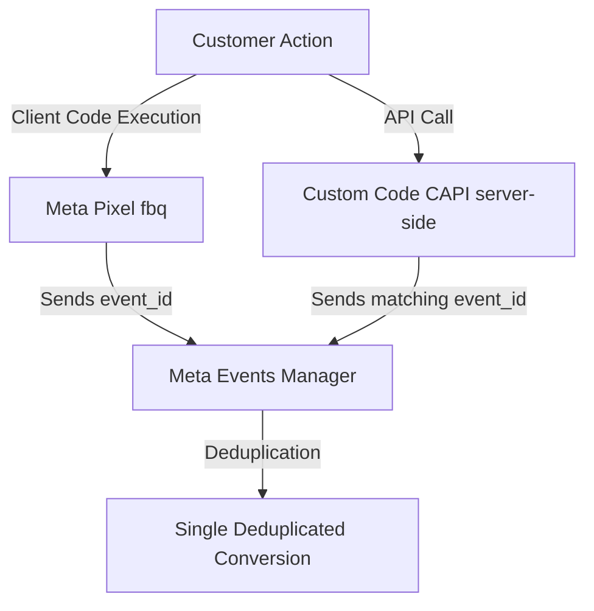

# Meta Pixel & Conversions API Configuration Guide

*Target Audience: Marketing Team & Developers*

This guide outlines the step-by-step process for configuring our hybrid tracking system, where **both** the Meta Pixel (client-side) and Conversions API (server-side) are implemented directly in our application's source code, completely bypassing Google Tag Manager (GTM).

---

## 🏗️ 1. The Architecture Overview

Our tracking system relies on two simultaneous data streams that Meta merges into a single deduplicated event:

1. **Client-Side (React/Next.js Code)**: Triggers the Meta Pixel directly in the browser using the standard `fbq()` function.
2. **Server-Side (Node.js/Next.js API)**: Triggers a secure, unblockable event from our backend.



---

## 🛠️ Step 1: Configure Client-Side Pixel (Direct Code)

Instead of pushing to a data layer, we initialize the Facebook Pixel snippet globally and call `fbq()` directly from our frontend components.

### A. Initializing the Pixel
Add the base Facebook Pixel script to your global application layout (e.g., `app/layout.tsx` or `pages/_app.tsx`).

### B. Triggering Events (Developer)
When a user takes an action (like completing a purchase), you trigger the event directly. **You must generate and pass a unique `eventID`** so Meta can deduplicate it with the server event.

Example for a **Purchase** event triggered in a React component:
```javascript
// Function called upon successful checkout
const trackPurchase = (orderData) => {
  // 1. Must match the event_id sent from the server!
  const eventId = `purchase_${orderData.orderId}`; 

  // 2. Fire the standard Pixel event
  if (typeof window !== 'undefined' && window.fbq) {
    window.fbq(
      'track', 
      'Purchase', 
      {
        value: orderData.totalAmount,
        currency: 'BDT',
        content_ids: orderData.items.map(item => item.id),
        content_type: 'product',
        // Advanced matching parameters (unhashed on client-side)
        em: orderData.customerEmail,
        ph: orderData.customerPhone,
        fn: orderData.customerFirstName,
        ln: orderData.customerLastName
      },
      // 3. Pass the eventID in the eventData object for deduplication
      { eventID: eventId }
    );
  }
};
```

---

## 💻 Step 2: Configure Custom Code CAPI (Server-Side)

Our backend server captures the exact same order and sends it directly to the Meta Graph API.

### A. Environment Variables
Ensure your production server has the following credentials:
```env
META_PIXEL_ID=your_pixel_id
META_ACCESS_TOKEN=your_conversions_api_access_token
```

### B. The API Request (Developer)
The server must send an HTTP POST request to the Meta Graph API. 

*Key Requirements for the server payload:*
- `event_name` must perfectly match the Pixel event (e.g., `"Purchase"`).
- `event_id` **MUST BE IDENTICAL** to the `eventID` passed to the `fbq()` call on the client.
- Customer data (Email, Phone) must be hashed using **SHA-256** before sending.

Example Server Payload (`POST https://graph.facebook.com/v19.0/{META_PIXEL_ID}/events`):
```json
{
  "data": [
    {
      "event_name": "Purchase",
      "event_time": 1716124500,
      "event_id": "purchase_123456789", 
      "action_source": "website",
      "user_data": {
        "client_ip_address": "192.168.1.1",
        "client_user_agent": "Mozilla/5.0 (Macintosh; Intel Mac OS X 10_15_7)...",
        "em": ["f660ab912ec121d1b1e928a0bb4bc61b15f5ad44d5efdc4e1c92a25e99b8e44a"],
        "ph": ["254aa248acb47dd654ca3ea53f48c2c26d641d23d7e2e93a1bf5b4fac369408b"]
      },
      "custom_data": {
        "currency": "BDT",
        "value": 1500.00,
        "content_ids": ["69f78cb1f5c096a3f7b8a642"],
        "content_type": "product"
      }
    }
  ],
  "access_token": "your_conversions_api_access_token"
}
```

---

## 🛡️ Step 3: Verifying Event Deduplication

Because we are firing two events (Direct Client Pixel + Server CAPI), we must verify that Meta is merging them to prevent double-counting sales.

1. Go to **Meta Events Manager**.
2. Select your Data Source (Pixel).
3. Under the **Overview** tab, click on the **Purchase** event to open its details.
4. Look at the **Event Responses** tab. You should see both **Browser** and **Server** receiving events.
5. Click on **Deduplication**. It should show a high overlap and state that events are being successfully deduplicated. 
   - *If deduplication fails, verify that the `eventID` in the `fbq()` call perfectly matches the `event_id` sent by your server code.*

---

## ✅ Step 4: Testing the Setup

1. **Test Browser Events (Client-Side)**:
   - Install the **Meta Pixel Helper** Chrome extension.
   - Trigger a test event on your website.
   - Click the Pixel Helper extension and verify the event fired successfully, expanding it to ensure the `Event ID` is attached.

2. **Test CAPI Events (Server-Side)**:
   - Go to **Events Manager -> Test Events**.
   - Copy your **Test Event Code** (e.g., `TEST12345`).
   - Append this code to your server payload under the `test_event_code` parameter.
   - Run a test checkout. 
   - Verify that the event instantly appears in the Test Events tab with the "Server" label, and eventually merges with the "Browser" event.
